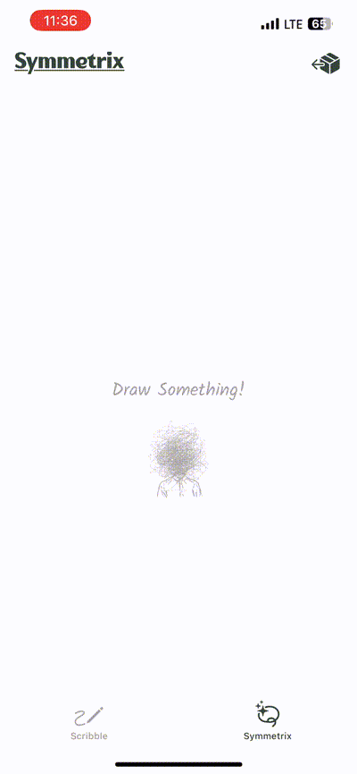
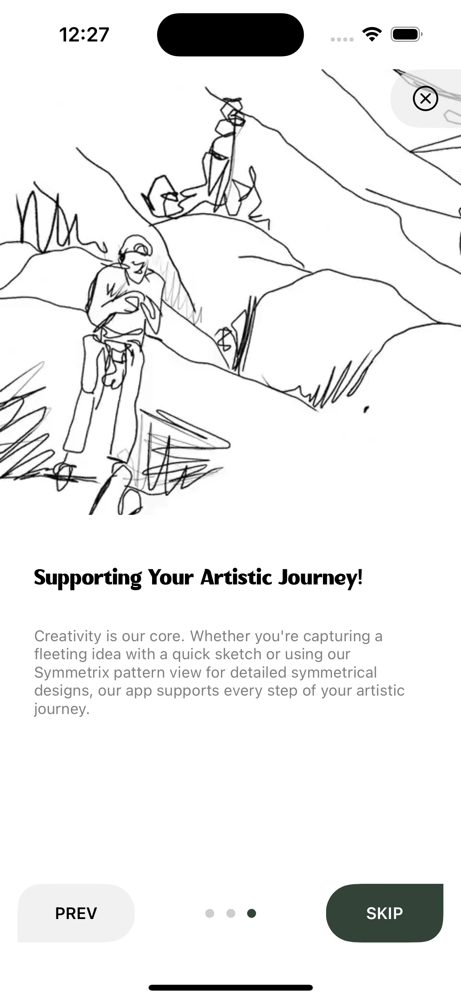
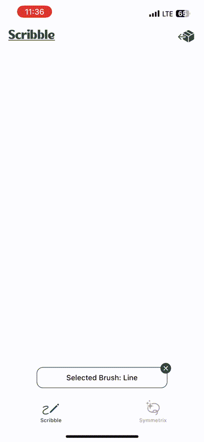
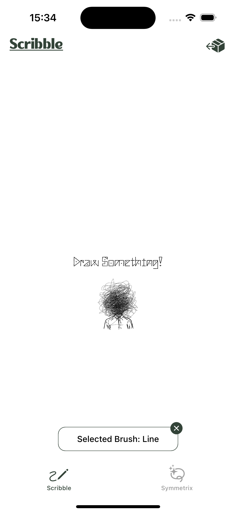
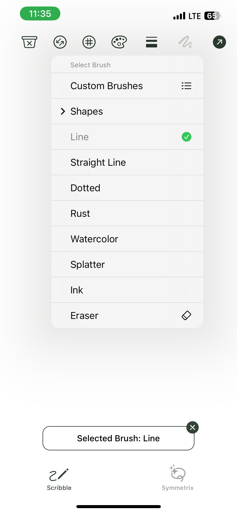

# Scribble: Minimal Symmetry and Drawing App for iOS

Scribble is an easy-to-use iOS drawing app for iOS that makes it easy to create quick sketches, imaginative doodles, and captivating symmetric designs. With a range of user-friendly tools and features, Scribble offers everything you need to explore your creativity and craft beautiful artwork on the go.

### Photos Sample

<table>
  <tr>
    <td></td>
    <td></td>
    
  </tr>
  <tr>
    <td></td>
    <td></td>
  </tr>
  <tr>
    <td></td>
    <td></td>
  </tr>
</table>


## Table of Contents

1. [Overview](#overview)
2. [Getting Started](#getting-started)
3. [App Features](#app-features)
4. [Drawing Modes](#drawing-modes)
5. [Brush Types and Tools](#brush-types-and-tools)
6. [User Interface Guide](#user-interface-guide)
7. [Contributing](#contributing)
8. [Contact](#contact)
9. [License](#license)

## Overview

Scribble is designed to support creative expression by providing a simple platform to sketch and design. The app comes with various brushes, color options, and a unique symmetric drawing mode called Symmetrix. It is perfect for users of all skill levels to create beautiful artwork and intricate patterns.

## Getting Started

To get started with Scribble, follow these steps:

### Prerequisites

- iOS 17.0 or later
- Xcode 15 or later

### Installation

1. **Clone the repository**:

    ```bash
    git clone https://github.com/aidinahmadian/Drawing-App
    ```

2. **Open the project** in Xcode.
3. **Select your development team** under "Signing & Capabilities".
4. **Run the app** on a simulator or a connected device by clicking the "Run" button or pressing `Cmd+R`.

## App Features

- **Freeform Drawing**: Draw anything with a variety of brush styles and colors.
- **Symmetry Mode**: Create symmetric designs with a unique radial pattern feature.
- **Customizable Brushes**: Choose from multiple brush types like Line, Dotted, Rust, Watercolor, and more.
- **Shape Tools**: Easily draw shapes like circles, stars, and hexagons.
- **Color Picker**: A versatile color picker to choose the perfect color for your drawings.
- **Undo/Redo**: Quick undo/redo actions to perfect your drawings.
- **Save and Share**: Save your drawings to your device or share them directly.

## Drawing Modes

Scribble supports two main drawing modes:

1. **Scribble Mode**: This is the default freeform drawing mode where you can use various brushes and tools to draw anything you like.
2. **Symmetrix Mode**: A unique mode where your brush strokes are mirrored in a radial pattern, allowing you to create beautiful, symmetric designs easily.

## Brush Types and Tools

Scribble offers a range of brush types, each with its own unique style:

- **Line**: A solid line for standard drawing.
- **Straight Line**: A tool for drawing straight lines.
- **Dotted**: A dotted line brush for adding texture.
- **Rust**: A rough, textured brush for a natural, earthy feel.
- **Watercolor**: Mimics the effect of watercolor painting with smooth, blended strokes.
- **Splatter**: Adds a splattered paint effect to your drawings.
- **Ink**: An ink-style brush for bold, sharp strokes.
- **Eraser**: Erase parts of your drawing with the eraser tool.
- **CustomBrushes**: (Coming Soon!)

### Customizing Brushes

You can customize each brush by adjusting its size, opacity, and color. To customize a brush:

1. Select the brush from the brush menu.
2. Use the sliders to adjust size and opacity.
3. Tap on the color picker to choose a new color.

## User Interface Guide

The Scribble app features a clean, intuitive user interface with the following components:

- **Top Toolbar**:
  - **Brush Menu**: Select and customize brushes.
  - **Color Picker**: Choose from preset colors or create your custom color.
  - **Undo/Redo Buttons**: Undo or redo your last action.
  - **Clear Canvas Button**: Clear the entire canvas to start fresh.
  - **Export Button**: Save or share your drawing.

- **Bottom Toolbar**:
  - **Drawing Modes**: Switch between Scribble (freeform) and Symmetrix (symmetry) modes.

## Saving Drawings to Your Phone

To save your drawings to your phone, follow these steps:

1. **Draw and Complete Your Artwork**: Use the available brushes and tools to create your drawing.
2. **Tap the Export Button**: Located at the top toolbar, tap the export (download) button.
3. **Allow Permission to Save Photos**: The first time you try to save a drawing, the app will request permission to access your photo library. Approve this permission.
4. **Save the Drawing**: After granting permission, your drawing will be saved directly to your Photos app under “Recents” or the folder you specified.

### Required `Info.plist` Configuration

To save photos to the user's phone, you must add the following key-value pair to your `Info.plist` file:

```xml
<key>NSPhotoLibraryAddUsageDescription</key>
<string>This app requires access to your photo library to save your drawings.</string>
```

This permission request message will be shown to users the first time they attempt to save a photo.

## Adding Custom Fonts

To use custom fonts in your iOS app, you need to add the font files to your project and configure the `Info.plist` file correctly. Here’s how you can do it:

1. **Add Font Files to Your Project**:
   - Drag and drop the custom font files (e.g., `.ttf`, `.otf`, `.ttc`) into your Xcode project. Ensure that they are added to the "Copy Bundle Resources" section under "Build Phases" and that the target is checked.

2. **Update `Info.plist`**:
   - Open your `Info.plist` file and add a new entry named `Fonts provided by application` of type `Array`.
   - For each custom font file, add a new `String` item with the exact name of the font file, including its extension. Your setup should look like this:

    ```xml
    <key>UIAppFonts</key>
    <array>
        <string>HelveticaNeue.ttc</string>
    </array>
    ```

3. **Use the Custom Fonts in Code**:
   - You can now use these fonts in your app programmatically or set them via Interface Builder. To use them in code, refer to the font by its PostScript name. For example:

    ```swift
    let label = UILabel()
    label.font = UIFont(name: "HelveticaNeue", size: 17)
    ```

   - Make sure to use the correct PostScript name for the font, which may differ slightly from the file name. You can check the font’s name in Font Book on macOS or by inspecting the font file.

By following these steps, you will be able to use custom fonts in your iOS app seamlessly. If the fonts don't appear correctly, double-check the font names and the entries in the `Info.plist` file to ensure there are no typos or missing files.


## Contributing

We welcome contributions to improve Scribble! If you'd like to contribute:

1. Fork the repository.
2. Create a new branch: `git checkout -b feature/your-feature`.
3. Make your changes and commit them: `git commit -m 'Add some feature'`.
4. Push to the branch: `git push origin feature/your-feature`.
5. Open a Pull Request.

## Contact

For questions, feedback, or suggestions, please feel free to contact the project maintainers:

- **Email**: ahmadian_aidin@yahoo.com
- **GitHub Issues**: Report bugs or request features on our [GitHub Issues page](https://github.com/aidinahmadian/Drawing-App/issues).

## License

This project is licensed under the MIT License. See the [LICENSE](LICENSE) file for more information.
